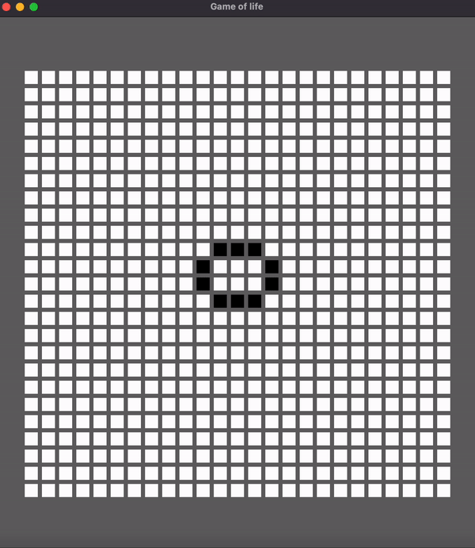

# Conway's Game of Life

Game of life written in rust. The game of life is written in the cgol directory and rendering is done by bevy in the gui directory.

A better version of this can be written purely in bevy using an ECS model but this is to serve as an example of having the game and rendering seperated completely.

